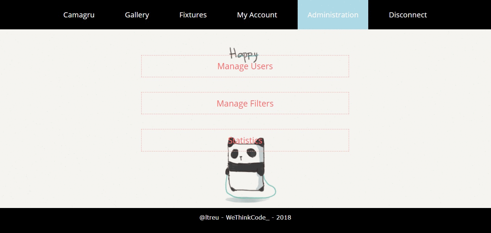

# Camagru

Welcome to Camagru; a social media inspired website that allows users to take pictures and beautify them, by adding fixtures(Frames and icons) to photos. This website also allows users to like and comment on the pictures of other users as well as store and upload their own photos to the user's defined gallery.

- - - -


- - - -

### Built using
* [PHP](http://www.php.net/) - Backend
* [Javascript](https://www.javascript.com/) - Frontend
* [MySQL](https://www.mysql.com/fr/) - Database
* HTML/CSS - Frontend
* Ajax - XMLHttpRequest

- - - -

## You will need the following:
### _Prerequisites:_
You need to have installed [PHP](http://www.php.net/), [MySQL](https://www.mysql.com/fr/) and a local web server of your choice ([Apache](https://httpd.apache.org/), etc)

### _Modifying the config file:_
*config/database.php* contains all the information needed by [MySQL](https://www.mysql.com/fr/) to connect Camagru to its database. Modify it so it matches your MySQL config.
```
$DB_DSN = 'mysql:host=localhost; dbname=db_camagru';
$DB_USER = 'yourMysqlUsername';
$DB_PASSWORD = "yourMysqlPassword";
```
### Launch the server
Start the server you have installed.

### Create the database
Launch your browser and head on over to: [http://localhost/Camagru/config/setup.php](http://localhost/Camagru/config/setup.php) . This will automatically set up the database in your local server. and automatically redirect you to the home page. 

- - - -

## Here are some screens:
Home: 


Gallery:


Fixtures:


Register:


Login:


My Account:


Administration:


## Author
* **Laune Treu** - *Frontend and Backend* - [LTreu](https://github.com/ltreu), [Skyla Darkthorn](https://github.com/SkylaDarkthorn)